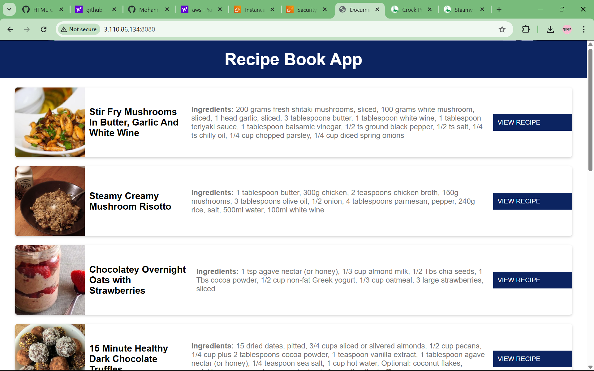
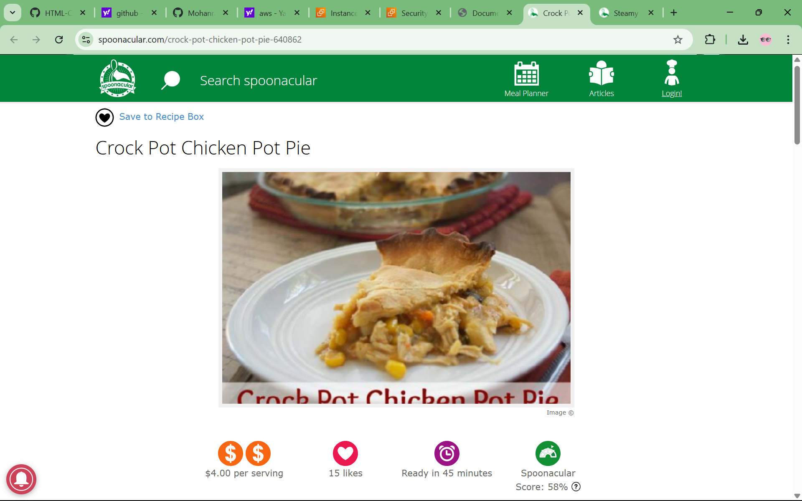
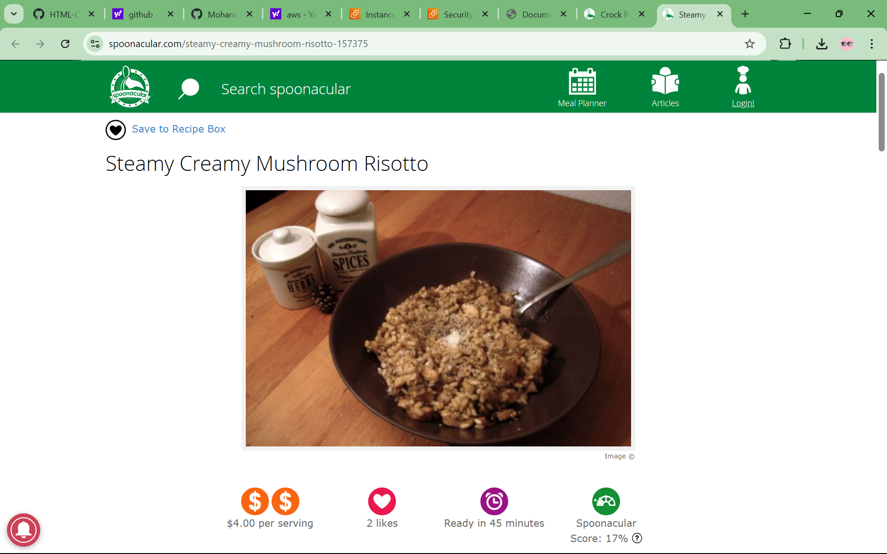

🌐 ***Recipe-Book-app***

 A modern web application deployed with DevOps best practices.

This project is a fully responsive and interactive web application built using HTML, CSS, and JavaScript. It follows DevOps principles by incorporating:

✔️ **Modern UI Design** – Responsive & interactive frontend.  
✔️ **Dockerized Deployment** – Packaged into a Docker container.  
✔️ **Port Mapping** – Accessible via assigned ports.  
✔️ **Version Control** – Managed with Git & GitHub. 

 📸 **Screenshots**:

🛠️ **Tech Stack & Tools**:

Technology	                                             Purpose
HTML5, CSS3, JavaScript	                     Frontend design & interactions
Git & GitHub	                                Version control & repository hosting
Docker	                                      Containerization using Dockerfile & port mapping
Nginx/Apache                                	Web server for production (if configured)

## 📂 **Project Structure**  

recipe-book-app/
│── Dockerfile         # Docker configuration for containerization
│── Homepage.png       # Screenshot of the homepage
│── Features1.png      # Screenshot of feature section 1
│── Features2.png      # Screenshot of feature section 2
│── README.md          # Documentation file
│── index.html         # Main HTML file (Frontend UI)
│── index.js           # JavaScript file for interactivity
│── style.css          # CSS file for styling

**Run with Docker**
Step 1: Build the Docker Image
  ->    docker build -t my-web-app .
      
Step 2: Run the Container
  ->    docker run -d -p 8080:80 my-web-app

**Now open http://localhost:8080 in your browser**

***📌 Dockerfile Used***
This project is containerized using the following Dockerfile:

dockerfile

# Use an official Nginx image as the base
FROM nginx:latest

# Copy website files to the Nginx HTML directory
COPY . /usr/share/nginx/html

# Expose port 80
EXPOSE 80

# Start Nginx
CMD ["nginx", "-g", "daemon off;"]

**🔗 Contributing**
1)Fork the Repository
2)Clone Your Fork
     git clone https://github.com/Mohanrao1231/recipe-book-app.git
3)Create a Feature Branch
     checkout -b new-feature
4)Commit Changes & Push
     git add .
     git commit -m "Added new feature"
     git push origin new-feature
5)Create a Pull Request on GitHub.

**❓ FAQ**
🔹 Can I run this project without Docker?
        Yes! Just open index.html in your browser.

🔹 How do I stop the running Docker container?
       docker ps            # Get container ID  
       docker stop <container-id>
  
🔹 How do I remove the container and image?
      docker rm <container-id>  # Remove container  
      docker rmi my-web-app     # Remove image

💬 Contact & Support
📧 Email: mohanchokkaku@gmail.com
📌 GitHub: Mohanrao1231

 
