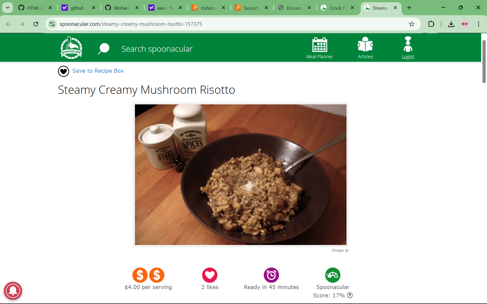

🌐 Recipe-Book-app

 A modern web application deployed with DevOps best practices.

This project is a fully responsive and interactive web application built using HTML, CSS, and JavaScript. It follows DevOps principles by incorporating:
✅ Version Control (Git & GitHub)
✅ CI/CD Pipeline (GitHub Actions/Jenkins)
✅ Containerization (Docker)
✅ Infrastructure as Code (IaC) (Terraform/Ansible)
✅ Cloud Deployment (AWS/GCP/Azure)

 📸 Screenshots

(Screenshot2.png)

 
